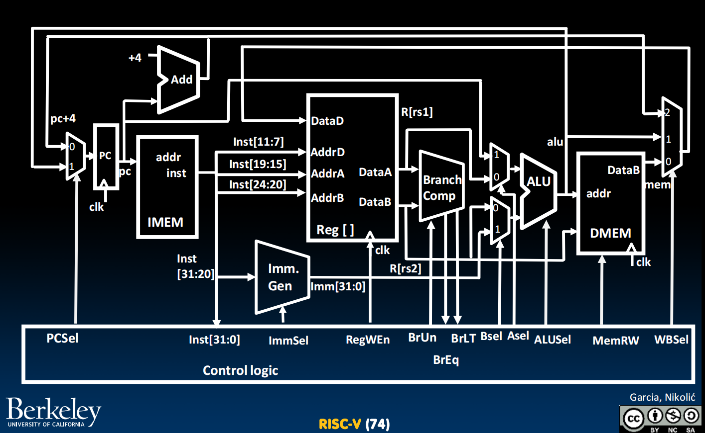
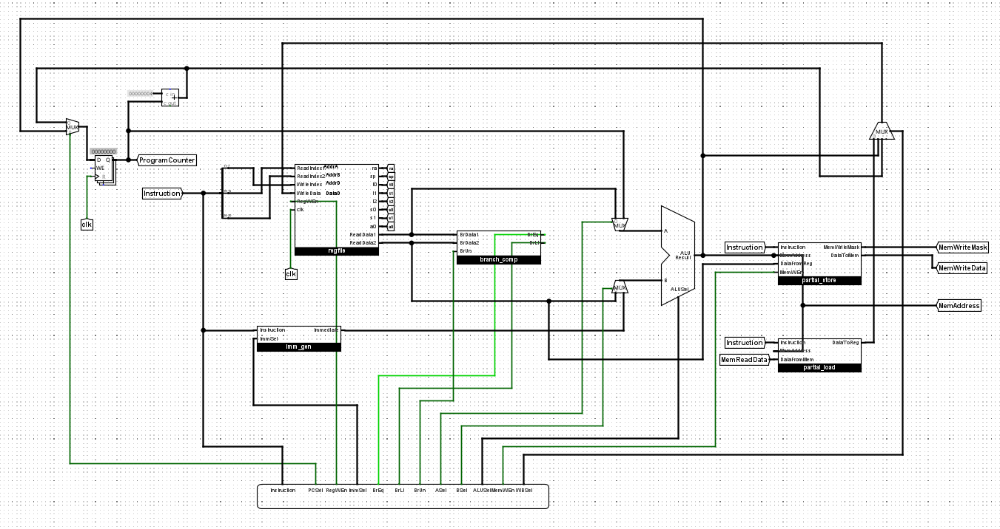
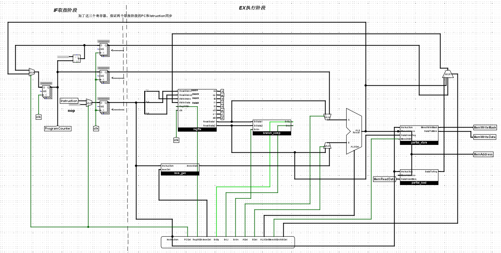

# RISC-V所有寄存器名称及其ABI名称

| 编号 | 名称（xN） | ABI 名称                         | 用途说明                   |
| ---- | ---------- | -------------------------------- | -------------------------- |
| x0   | zero       | zero                             | 常数 0，读取为 0，写入无效 |
| x1   | ra         | return address                   | 函数返回地址               |
| x2   | sp         | stack pointer                    | 栈顶指针                   |
| x3   | gp         | global pointer                   | 全局变量指针               |
| x4   | tp         | thread pointer                   | 线程局部存储指针           |
| x5   | t0         | temporary 0                      | 临时寄存器（调用者保存）   |
| x6   | t1         | temporary 1                      | 临时寄存器（调用者保存）   |
| x7   | t2         | temporary 2                      | 临时寄存器（调用者保存）   |
| x8   | s0         | saved register 0 / frame pointer | 被调用者保存 / 栈帧指针    |
| x9   | s1         | saved register 1                 | 被调用者保存               |
| x10  | a0         | argument 0 / return value        | 函数参数 / 返回值          |
| x11  | a1         | argument 1                       | 函数参数 / 返回值          |
| x12  | a2         | argument 2                       | 函数参数                   |
| x13  | a3         | argument 3                       | 函数参数                   |
| x14  | a4         | argument 4                       | 函数参数                   |
| x15  | a5         | argument 5                       | 函数参数                   |
| x16  | a6         | argument 6                       | 函数参数                   |
| x17  | a7         | argument 7                       | 函数参数                   |
| x18  | s2         | saved register 2                 | 被调用者保存               |
| x19  | s3         | saved register 3                 | 被调用者保存               |
| x20  | s4         | saved register 4                 | 被调用者保存               |
| x21  | s5         | saved register 5                 | 被调用者保存               |
| x22  | s6         | saved register 6                 | 被调用者保存               |
| x23  | s7         | saved register 7                 | 被调用者保存               |
| x24  | s8         | saved register 8                 | 被调用者保存               |
| x25  | s9         | saved register 9                 | 被调用者保存               |
| x26  | s10        | saved register 10                | 被调用者保存               |
| x27  | s11        | saved register 11                | 被调用者保存               |
| x28  | t3         | temporary 3                      | 临时寄存器（调用者保存）   |
| x29  | t4         | temporary 4                      | 临时寄存器（调用者保存）   |
| x30  | t5         | temporary 5                      | 临时寄存器（调用者保存）   |
| x31  | t6         | temporary 6                      | 临时寄存器（调用者保存）   |

**zero（x0）**：永远为 0

**ra（x1）**：返回地址

**sp（x2）**：栈指针

**gp / tp（x3–x4）**：全局 / 线程指针

**t0–t6（x5–x7, x28–x31）**：临时寄存器（调用者保存）

**s0–s11（x8–x9, x18–x27）**：保存寄存器（被调用者保存）

**a0–a7（x10–x17）**：函数参数 / 返回值


# 指令在32位中的字段布局

| 类型       | 字段布局（从左到右）                                         | 位位置说明                                                   |
| ---------- | ------------------------------------------------------------ | ------------------------------------------------------------ |
| **R-type** | `funct7` `rs2` `rs1` `funct3` `rd` `opcode`                  | `[31:25]` `[24:20]` `[19:15]` `[14:12]` `[11:7]` `[6:0]`     |
| **I-type** | `imm[11:0]` `rs1` `funct3` `rd` `opcode`                     | `[31:20]` `[19:15]` `[14:12]` `[11:7]` `[6:0]`               |
| **S-type** | `imm[11:5]` `rs2` `rs1` `funct3` `imm[4:0]` `opcode`         | `[31:25]` `[24:20]` `[19:15]` `[14:12]` `[11:7]` `[6:0]`     |
| **B-type** | `imm[12]` `imm[10:5]` `rs2` `rs1` `funct3` `imm[4:1]` `imm[11]` `opcode` | `[31]` `[30:25]` `[24:20]` `[19:15]` `[14:12]` `[11:8]` `[7]` `[6:0]` |
| **U-type** | `imm[31:12]` `rd` `opcode`                                   | `[31:12]` `[11:7]` `[6:0]`                                   |
| **J-type** | `imm[20]` `imm[10:1]` `imm[11]` `imm[19:12]` `rd` `opcode`   | `[31]` `[30:21]` `[20]` `[19:12]` `[11:7]` `[6:0]`           |


# 指令

你需要让CPU能实现如下全部指令

##  I-type 指令（立即数运算 / load / jalr ）

| 指令              | 类型 | Opcode | Funct3 | Funct7 | 操作说明                                |
| ----------------- | ---- | ------ | ------ | ------ | --------------------------------------- |
| addi rd, rs1, imm | I    | 0x13   | 0x0    |        | rd ← rs1 + imm                          |
| andi rd, rs1, imm | I    | 0x13   | 0x7    |        | rd ← rs1 & imm                          |
| ori rd, rs1, imm  | I    | 0x13   | 0x6    |        | rd ← rs1 \| imm                         |
| xori rd, rs1, imm | I    | 0x13   | 0x4    |        | rd ← rs1 ^ imm                          |
| slli rd, rs1, imm | I    | 0x13   | 0x1    | 0x00   | rd ← rs1 << imm                         |
| srli rd, rs1, imm | I    | 0x13   | 0x5    | 0x00   | rd ← rs1 >> imm （逻辑右移，零扩展）    |
| srai rd, rs1, imm | I    | 0x13   | 0x5    | 0x20   | rd ← rs1 >> imm （算术右移，符号扩展）  |
| slti rd, rs1, imm | I    | 0x13   | 0x2    |        | rd ← (rs1 < imm) ? 1 : 0 （有符号比较） |


##  R-type 指令（寄存器运算）

| 指令               | 类型 | Opcode | Funct3 | Funct7 | 操作说明                                             |
| ------------------ | ---- | ------ | ------ | ------ | ---------------------------------------------------- |
| add rd, rs1, rs2   | R    | 0x33   | 0x0    | 0x00   | rd ← rs1 + rs2                                       |
| sub rd, rs1, rs2   | R    | 0x33   | 0x0    | 0x20   | rd ← rs1 - rs2                                       |
| and rd, rs1, rs2   | R    | 0x33   | 0x7    | 0x00   | rd ← rs1 & rs2                                       |
| or rd, rs1, rs2    | R    | 0x33   | 0x6    | 0x00   | rd ← rs1 \| rs2                                      |
| xor rd, rs1, rs2   | R    | 0x33   | 0x4    | 0x00   | rd ← rs1 ^ rs2                                       |
| sll rd, rs1, rs2   | R    | 0x33   | 0x1    | 0x00   | rd ← rs1 << (rs2[4:0])                               |
| srl rd, rs1, rs2   | R    | 0x33   | 0x5    | 0x00   | rd ← rs1 >> (rs2[4:0]) （逻辑右移，零扩展）          |
| sra rd, rs1, rs2   | R    | 0x33   | 0x5    | 0x20   | rd ← rs1 >>> (rs2[4:0]) （算术右移，符号扩展）       |
| slt rd, rs1, rs2   | R    | 0x33   | 0x2    | 0x00   | rd ← (rs1 < rs2) ? 1 : 0 （有符号比较）              |
| mul rd, rs1, rs2   | R    | 0x33   | 0x0    | 0x01   | rd ← (rs1 * rs2)[31:0] （低 32 位结果）              |
| mulh rd, rs1, rs2  | R    | 0x33   | 0x1    | 0x01   | rd ← (rs1 * rs2)[63:32] （高 32 位结果，有符号乘法） |
| mulhu rd, rs1, rs2 | R    | 0x33   | 0x3    | 0x01   | rd ← (rs1 * rs2)[63:32] （高 32 位结果，无符号乘法） |


##  B-type 指令（分支跳转）

| 指令                  | 类型 | Opcode | Funct3 | 操作说明                                           |
| --------------------- | ---- | ------ | ------ | -------------------------------------------------- |
| beq rs1, rs2, offset  | B    | 0x63   | 0x0    | 若 (rs1 == rs2)，则 PC ← PC + offset               |
| bne rs1, rs2, offset  | B    | 0x63   | 0x1    | 若 (rs1 != rs2)，则 PC ← PC + offset               |
| blt rs1, rs2, offset  | B    | 0x63   | 0x4    | 若 (rs1 < rs2) （有符号比较），则 PC ← PC + offset |
| bge rs1, rs2, offset  | B    | 0x63   | 0x5    | 若 (rs1 ≥ rs2) （有符号比较），则 PC ← PC + offset |
| bltu rs1, rs2, offset | B    | 0x63   | 0x6    | 若 (rs1 < rs2) （无符号比较），则 PC ← PC + offset |
| bgeu rs1, rs2, offset | B    | 0x63   | 0x7    | 若 (rs1 ≥ rs2) （无符号比较），则 PC ← PC + offset |


##   L-type and S-type 指令（store）

| 指令                | 类型 | Opcode | Funct3 | 操作说明                                          |
| ------------------- | ---- | ------ | ------ | ------------------------------------------------- |
| lb rd, offset(rs1)  | I    | 0x03   | 0x0    | rd ← 从地址 (rs1 + imm) 取 1 字节，并进行符号扩展 |
| lh rd, offset(rs1)  | I    | 0x03   | 0x1    | rd ← 从地址 (rs1 + imm) 取 2 字节，并进行符号扩展 |
| lw rd, offset(rs1)  | I    | 0x03   | 0x2    | rd ← 从地址 (rs1 + imm) 取 4 字节（一个 word）    |
| sb rs2, offset(rs1) | S    | 0x23   | 0x0    | 将 rs2 的最低有效字节存入地址 (rs1 + imm)         |
| sh rs2, offset(rs1) | S    | 0x23   | 0x1    | 将 rs2 的最低 2 字节存入地址 (rs1 + imm)          |
| sw rs2, offset(rs1) | S    | 0x23   | 0x2    | 将 rs2 的 32 位数据存入地址 (rs1 + imm)           |


## Jumps（跳转） and U-type（高位立即数）

| 指令              | 类型 | Opcode | Funct3 | 操作说明                      |
| ----------------- | ---- | ------ | ------ | ----------------------------- |
| jal rd, imm       | J    | 0x6f   |        | rd ← PC + 4；PC ← PC + offset |
| jalr rd, rs1, imm | I    | 0x67   | 0x0    | rd ← PC + 4；PC ← rs1 + imm   |
| auipc rd, imm     | U    | 0x17   |        | rd ← PC + imm                 |
| lui rd, imm       | U    | 0x37   |        | rd ← imm                      |


​	


# 任务：

## alu.circ

| ALUSel Value | Instruction                              |
| ------------ | ---------------------------------------- |
| 0            | add: `Result = A + B`                    |
| 1            | sll: `Result = A << B[4:0]`              |
| 2            | slt: `Result = (A < B (signed)) ? 1 : 0` |
| 3            | Unused                                   |
| 4            | xor: `Result = A ^ B`                    |
| 5            | srl: `Result = (unsigned) A >> B[4:0]`   |
| 6            | or: `Result = A | B`                     |
| 7            | and: `Result = A & B`                    |
| 8            | mul: `Result = (signed) (A * B)[31:0]`   |
| 9            | mulh: `Result = (signed) (A * B)[63:32]` |
| 10           | Unused                                   |
| 11           | mulhu: `Result = (A * B)[63:32]`         |
| 12           | sub: `Result = A - B`                    |
| 13           | sra: `Result = (signed) A >> B[4:0]`     |
| 14           | Unused                                   |
| 15           | bsel: `Result = B`                       |

### 测试

```bash
bash test.sh test_alu
```


## RegFile.circ

输入信号（Input）

| 信号名称     | 位宽 | 说明                                                       |
| ------------ | ---- | ---------------------------------------------------------- |
| `ReadIndex1` | 5    | 指定要读取的第一个寄存器编号，其值将输出到 `ReadData1`     |
| `ReadIndex2` | 5    | 指定要读取的第二个寄存器编号，其值将输出到 `ReadData2`     |
| `WriteIndex` | 5    | 指定要写入的寄存器编号（在时钟上升沿且 `RegWEn=1` 时生效） |
| `WriteData`  | 32   | 要写入寄存器的数据（在时钟上升沿且 `RegWEn=1` 时生效）     |
| `RegWEn`     | 1    | 写使能信号，为 1 时允许在时钟上升沿写入寄存器              |
| `clk`        | 1    | 时钟信号                                                   |

 输出信号（Output）

| 信号名称    | 位宽 | 说明                            |
| ----------- | ---- | ------------------------------- |
| `ReadData1` | 32   | `ReadIndex1` 指定的寄存器的值   |
| `ReadData2` | 32   | `ReadIndex2` 指定的寄存器的值   |
| `ra`        | 32   | 寄存器 x1（返回地址寄存器）的值 |
| `sp`        | 32   | 寄存器 x2（堆栈指针）的值       |
| `t0`        | 32   | 寄存器 x5 的值                  |
| `t1`        | 32   | 寄存器 x6 的值                  |
| `t2`        | 32   | 寄存器 x7 的值                  |
| `s0`        | 32   | 寄存器 x8 的值                  |
| `s1`        | 32   | 寄存器 x9 的值                  |
| `a0`        | 32   | 寄存器 x10 的值                 |

### 测试

```bash
bash test.sh test_regfile
```


## imm-gen.circ

这个任务要求你在 **Logisim** 中实现一个 **立即数生成器（Immediate Generator）**，它的作用是： 从指令的不同字段中提取出 **立即数（immediate）**，并进行正确的 **符号扩展**，供 ALU 或其他单元使用。

不同指令类型的立即数格式

| 指令类型   | ImmSel | 立即数构造方式（按位拼接）                                   | 说明          |
| ---------- | ------ | ------------------------------------------------------------ | ------------- |
| **I-type** | `000`  | `imm[11:0] = inst[31:20]`                                    | **符号扩展**  |
| **S-type** | `001`  | `imm[11:5] = inst[31:25]`<br>`imm[4:0] = inst[11:7]`         | **符号扩展**  |
| **B-type** | `010`  | `imm[12] = inst[31]`<br>`imm[11] = inst[7]`<br>`imm[10:5] = inst[30:25]`<br>`imm[4:1] = inst[11:8]`<br>`imm[0] = 0` | **符号扩展**  |
| **U-type** | `011`  | `imm[31:12] = inst[31:12]`<br>`imm[11:0] = 0`                | **左移 12位** |
| **J-type** | `100`  | `imm[20] = inst[31]`<br>`imm[19:12] = inst[19:12]`<br>`imm[11] = inst[20]`<br>`imm[10:1] = inst[30:21]`<br>`imm[0] = 0` | **符号扩展**  |

### 测试

```bash
bash test.sh test_imm_gen
```


## branch_comp.circ

| 信号名称 | 方向 | 位宽 | 描述                                           |
| -------- | ---- | ---- | ---------------------------------------------- |
| BrData1  | 输入 | 32   | 第一个比较值                                   |
| BrData2  | 输入 | 32   | 第二个比较值                                   |
| BrUn     | 输入 | 1    | 当为 1 时执行无符号比较；为 0 时执行有符号比较 |
| BrEq     | 输出 | 1    | 若两个值相等则置为 1                           |
| BrLt     | 输出 | 1    | 若 rs1 的值小于 rs2 的值则置为 1               |

### 测试

```bash
bash test.sh test_branch_comp
```


## partial_load.circ

| 信号名称    | 方向 | 位宽 | 描述                             |
| ----------- | ---- | ---- | -------------------------------- |
| Instruction | 输入 | 32   | 正在执行的 load 指令             |
| MemAddress  | 输入 | 32   | 要读取的内存地址（低两位不清零） |
| DataFromMem | 输入 | 32   | 从 DMEM 读取的数据               |
| DataToReg   | 输出 | 32   | 要写入寄存器的数据               |

| 指令               | 类型 | Opcode | Funct3 | MemAddress 低两位 | 写入 DataToReg 的值         |
| ------------------ | ---- | ------ | ------ | ----------------- | --------------------------- |
| lb rd, offset(rs1) | I    | 0x03   | 0x0    | 0b00              | SignExt(DataFromMem[7:0])   |
|                    |      |        |        | 0b01              | SignExt(DataFromMem[15:8])  |
|                    |      |        |        | 0b10              | SignExt(DataFromMem[23:16]) |
|                    |      |        |        | 0b11              | SignExt(DataFromMem[31:24]) |
| lh rd, offset(rs1) | I    | 0x03   | 0x1    | 0b00              | SignExt(DataFromMem[15:0])  |
|                    |      |        |        | 0b01              | SignExt(DataFromMem[23:8])  |
|                    |      |        |        | 0b10              | SignExt(DataFromMem[31:16]) |
| lw rd, offset(rs1) | I    | 0x03   | 0x2    | 0b00              | DataFromMem                 |

### 测试

```bash
bash test.sh test_partial_load
```


## partial_store.circ

| 信号名称     | 方向 | 位宽 | 描述                                    |
| ------------ | ---- | ---- | --------------------------------------- |
| Instruction  | 输入 | 32   | 正在执行的 store 指令                   |
| MemAddress   | 输入 | 32   | 要写入的内存地址（低两位不清零）        |
| DataFromReg  | 输入 | 32   | 来自寄存器的数据                        |
| MemWEn       | 输入 | 1    | 控制信号，指示是否允许写入内存          |
| DataToMem    | 输出 | 32   | 要写入内存的数据                        |
| MemWriteMask | 输出 | 4    | 写掩码，指示 DataToMem 的哪些字节会写入 |

| 指令                | Funct3 | MemAddress 低两位 | DataToMem (各字节位置)                                 | MemWriteMask |
| ------------------- | ------ | ----------------- | ------------------------------------------------------ | ------------ |
| sb rs2, offset(rs1) | 0x0    | 0b00              | [31-24]=0, [23-16]=0, [15-8]=0, [7-0]=DataFromReg[7:0] | 0b0001       |
|                     |        | 0b01              | [31-24]=0, [23-16]=0, [15-8]=DataFromReg[7:0], [7-0]=0 | 0b0010       |
|                     |        | 0b10              | [31-24]=0, [23-16]=DataFromReg[7:0], [15-8]=0, [7-0]=0 | 0b0100       |
|                     |        | 0b11              | [31-24]=DataFromReg[7:0], [23-16]=0, [15-8]=0, [7-0]=0 | 0b1000       |
| sh rs2, offset(rs1) | 0x1    | 0b00              | [31-16]=0, [15-0]=DataFromReg[15:0]                    | 0b0011       |
|                     |        | 0b10              | [31-16]=DataFromReg[15:0], [15-0]=0                    | 0b1100       |
| sw rs2, offset(rs1) | 0x2    | 0b00              | [31-0]=DataFromReg                                     | 0b1111       |

### 测试

你可以运行以下命令测试你的子电路：

```bash
bash test.sh test_partial_store
```


## control_logic.circ

| 信号名称 | 位宽 | 目的                                                         |
| -------- | ---- | ------------------------------------------------------------ |
| PCSel    | 1    | 对所有 B 型分支指令（根据分支比较器输出）和所有跳转，选择 ALU 输入；其他指令选择 PC+4 输入 |
| ImmSel   | 3    | 选择指令格式，使立即数生成器正确提取立即数。[0b000=I][0b001=S][0b010=B][0b011=U][0b100=J] |
| RegWEn   | 1    | 若指令写入寄存器则为 1，否则为 0                             |
| BrUn     | 1    | 若分支指令为无符号比较则为 1，有符号比较则为 0；其他指令无需关心 |
| ASel     | 1    | 选择 ALU 的第一个输入：来自寄存器 (RegReadData1) 或 PC       |
| BSel     | 1    | 选择 ALU 的第二个输入：来自寄存器 (RegReadData2) 或立即数    |
| ALUSel   | 4    | 选择 ALU 的具体运算功能（见任务 1 的 ALU 功能映射表）        |
| MemRW    | 1    | 若指令写入内存则为 1，否则为 0                               |
| WBSel    | 2    | 选择写回寄存器的数据来源：来自 DMEM、ALU 输出或 PC+4         |

**control_logic.circ文件没有单独的测试方式，你需要实现单周期CPU后再运行以下命令进行测试**

```bash
Registers:              bash test.sh test_integration_all_regs"
Branches:               bash test.sh test_integration_branch"
Immediates:             bash test.sh test_integration_immediates"
Jumps:                  bash test.sh test_integration_jump"
lui:                    bash test.sh test_integration_lui"
Memory:                 bash test.sh test_integration_mem"
Basic programs:         bash test.sh test_integration_programs"
如果以上测试未通过，那么多半是control_logic.circ的问题
```


## CPU.circ

### 单周期CPU



实现如图所示的结构，只需要将对应组件相连

实现后如图所示

### 二级流水线CPU

实现后如图所示



